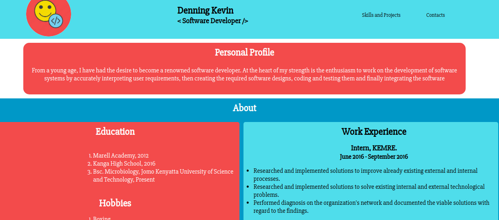

# DENNING KEVIN'S PORTFOLIO

## Description

This is an online portfolio belonging to Denning Kevin.

## Author
Denning Kevin

## Project's Screenshot

## Link to the Source
https://github.com/DENNINGKEVIN/IP-portfolio

## Live link to the Portfolio

https://DENNINGKEVIN.github.io/IP-portfolio

## How to setup

### First Method

* In the terminal navigate to the directory you want the project to reside in e.g (cd ~/Documents)
* Clone the project (git clone https://github.com/DENNINGKEVIN/IP-portfolio )
* Navigate into the created folder (cd IP-portfolio)
* Open the project with a text editor eg atom (atom .)

### Second Method
* Download the project's zip files
* Extract it to a  folder  of your choice
* In a text editor open the project's folder
